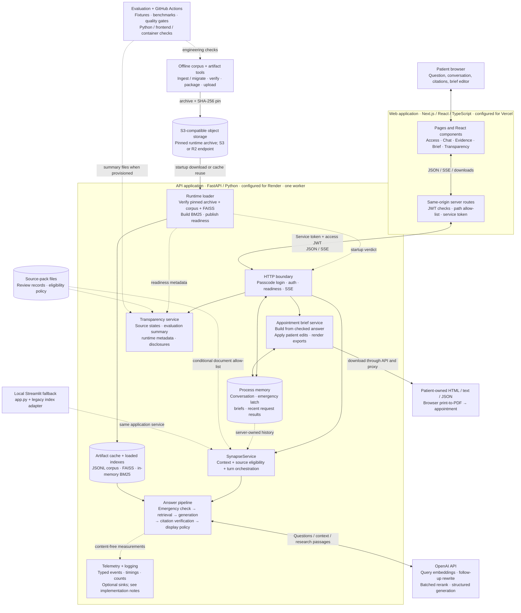
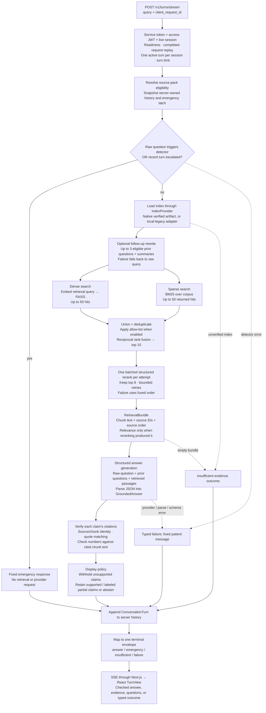
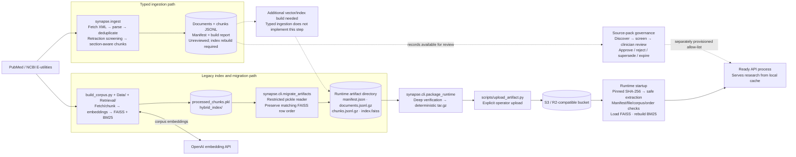
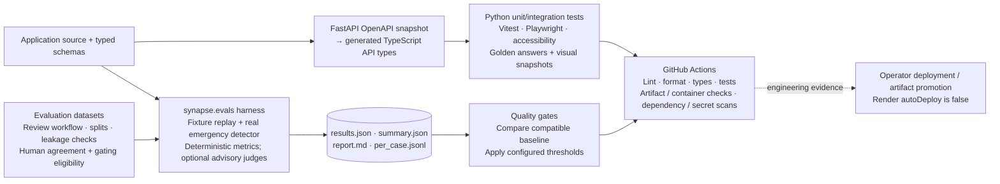

# Synapse product architecture

Code-grounded map of the working tree reviewed on **2026-09-11**, based on commit `9cfdbe6` plus existing local changes. Hosting labels describe the checked-in deployment configuration; this review did not inspect live Vercel, Render, or object-storage accounts.

Synapse is a patient appointment-preparation application. Its primary interface is Next.js, its API is FastAPI, and its shared Python service performs retrieval-augmented generation with emergency routing, citation checks, and a display policy. Research is prepared outside the request path and loaded as a versioned artifact. Conversations and appointment briefs live in API-process memory.

## 1. Whole-product view

Solid arrows show requests or data movement. Dotted arrows show optional paths, configuration, or build-time relationships. Boxes within the API boundary are modules in **one application process**, not separate microservices. The [standalone overview source](architecture-overview.mmd) can be opened in a Mermaid-compatible editor.



The response travels back through FastAPI and the Next.js proxy. The browser never receives the OpenAI key or the service token. The backend is protected by application authentication; the repository does not establish a private network between the hosting platforms.

## 2. One question, end to end



The two search branches represent distinct retrieval components; the implementation calls dense search and then sparse search sequentially. BM25 returns a bounded hit list but still scores the full corpus internally. Current defaults are 50 dense hits, 50 sparse hits, 10 fused candidates, and 8 reranked passages. Generation, rewriting, and reranking default to `gpt-4o-mini`; the query embedding model and dimensions come from the verified artifact manifest.

The SSE worker emits fixed stage messages and heartbeats, then a complete terminal envelope. It does not stream draft answer tokens. The stream deadline is 120 seconds and the heartbeat interval is 15 seconds. A deadline or disconnect does not cancel the Python worker; the session remains marked busy until that worker finishes.

`answer` envelopes can carry `answer`, `abstain`, or `medical_staff` actions. Abstention retains the appointment questions and includes an insufficient-evidence block. An index-verification failure or empty evidence maps to an `insufficient` envelope; other faults map to `failure`. The early deterministic routing branch is emergency routing; `medical_staff` can be selected in the generated structured answer.

**Verification scope:** the verifier checks claim citations, quoted passages, and numbers. It is not a semantic entailment or clinical-correctness check, and does not independently verify every sentence in the summary, clinician-evaluation text, or generated questions. The default display policy requires at least one displayable claim and a displayable ratio of 0.5; partially supported claims count toward that ratio.

## 3. Research, governance, and runtime artifacts



The native ingestion CLI writes records and a manifest with `index_state="rebuild_required"`; it does not compute embeddings or produce FAISS. The migration CLI can copy an existing FAISS index when its ordering still matches. The runtime package command accepts only an already-ready, verified directory. The additional vector-build box is a dependency gap, not an implemented native pipeline stage.

Runtime archives contain exactly four allowed files: `manifest.json`, `documents.jsonl.gz`, `chunks.jsonl.gz`, and `index.faiss`. They contain neither pickled BM25 state nor source-pack review files. At startup, the loader validates or downloads the pinned artifact, checks integrity and ordering, reconstructs BM25, checks FAISS dimensions/counts, and exposes readiness. It performs no PubMed ingestion or corpus embedding during normal startup.

Two artifact manifests are present locally. `artifacts/runtime/corpus-v2/manifest.json` declares 2,220 chunks/vectors with `text-embedding-3-small`, 1,536 dimensions, and `diabetes-previsit@0.1.0` as its source-pack version. `dist/artifact/manifest.json` also declares 2,220 chunks/vectors with the same embedding configuration but different version labels. These are local declarations, not evidence of which archive a live deployment serves.

## 4. Session, brief, and transparency flows

```mermaid
sequenceDiagram
    actor Patient
    participant Web as Next.js / React
    participant API as FastAPI
    participant Memory as In-memory SessionStore
    participant Brief as Brief builder / editor / exporter
    participant Files as Pack + evaluation files

    Patient->>Web: Enter shared passcode
    Web->>API: Login + server-held service token
    API->>Memory: Create random session ID
    API-->>Web: Signed access JWT
    Web-->>Patient: HttpOnly access cookie

    Patient->>Web: Ask a question
    Web->>API: Stream request + JWT + service token
    API->>Memory: Read history, check/release turn lock, record result
    API-->>Web: Stage events, then terminal envelope
    Web-->>Patient: Answer and evidence state

    Patient->>Web: Open appointment brief
    Web->>API: GET brief for turn
    API->>Memory: Read checked answer / cached brief
    API->>Brief: Build once from checked answer
    Brief-->>API: Typed AppointmentBrief
    API->>Memory: Cache brief by turn index
    API-->>Web: Brief
    Patient->>Web: Edit topic, notes, questions, sections
    Web->>API: Named edit operation
    API->>Brief: Apply edit to server-owned brief
    API->>Memory: Replace edited brief
    Patient->>Web: Download or print
    Web->>API: Export requested format
    API->>Brief: Render HTML / text / JSON in memory
    API-->>Patient: Attachment via Next.js; print-to-PDF in browser

    Patient->>Web: Open transparency page
    Web->>API: Read transparency + service token
    API->>Files: Read source pack and evaluation summary if present
    API-->>Web: Facts, readiness, disclosures, unavailable markers

    Patient->>Web: End session / sign out
    Web->>API: Delete session
    API->>Memory: Remove conversation, briefs, replay records
```

The JWT lasts 8 hours; the server session expires after 2 hours idle. Sessions allow 20 turns and one active turn at a time. The store retains up to 8 completed request results per session for replay. Conversation history is server-derived; clients cannot submit replacement history or clear the emergency latch. A restart loses sessions. Refreshing the frontend retrieves session counts, not a transcript, because completed turns are held in React memory and no transcript-read endpoint is provided.

Briefs are created from checked answers without another model call. Only topic, notes, patient questions/order, and section selection are editable through the API. Research claims and citations are server-owned. Emergency and failed turns have no brief. Exports are returned as bytes with `no-store`; the request path does not save a server-side export file. There is no built-in email delivery, EHR integration, or patient-record database in this codebase.

## 5. Engineering and evaluation support



The evaluation harness is distinct from the request service. It supports fixture responses and injected callable systems; the CLI's offline route replays fixture outputs while using the shipped emergency detector. Optional model judges are advisory. `synapse.bench` measures retrieval and compares it with a legacy baseline. The checked-in CI workflow runs engineering checks and offline evaluation; it does not publish an artifact or deploy the product.

The example source pack currently records **0 approved sources** and `approval_state="unapproved_example"`. The diabetes-previsit dataset contains **17 pending-review cases and 0 gating-eligible cases**. Synthetic CI results and technical integrity checks do not establish clinical validation.

## 6. Boundaries and implementation notes

| Boundary or behavior | What the current code actually does |
|---|---|
| Source approval versus runtime integrity | The governance module enforces reviewer/state rules, but `resolve_eligible_documents` returns `None` when the pack is absent, unreadable, or has no eligible documents. `search_candidates` interprets `None` as **no filtering**. A valid runtime archive therefore does not imply approved evidence. |
| Pack and evaluation provisioning | The Dockerfile does not copy `source_packs/` or evaluation reports; the runtime archive does not carry them either. They require separate provisioning for runtime filtering and transparency. A manifest's source-pack version string alone is not a loaded approval record. |
| Configured telemetry versus implemented sinks | `render.yaml` requests `SYNAPSE_TELEMETRY_SINK=stdout`, but `SinkKind` only supports `null`, `memory`, and `file`. The parser falls back to the local-file sink for `stdout`. Ordinary Python logs are separate. The diagram deliberately does not depict a functioning stdout telemetry exporter or hosted metrics system. |
| Conversation persistence and scale | One Uvicorn worker is configured because session state and safety history are process-local. Multiple workers or replicas require a shared session design or equivalent routing/state guarantees; simply adding workers changes behavior. |
| Provider data boundary | Query embedding sends the retrieval query to OpenAI. Rewrite sends bounded prior questions/summaries. Reranking sends the retrieval query and candidate passages. Generation sends the raw question, bounded prior questions, and retrieved passages. Brief notes do not enter that generation path. |
| Local fallback | `app.py` calls the same `SynapseService`, bound to `legacy_index.py` and legacy on-disk artifacts. `serve_api.py` also selects the legacy path if the artifact bucket is unset. The configured Docker deployment expects the native runtime artifact path and excludes the legacy implementation trees and pickle corpus. |
| Superseded modules | `Generation/answer_generator.py` is an emergency-routing compatibility shim; `Evaluation/Evaluator.py` is retired. They are not the active generation or evaluation engines. |
| Older documentation | The opening status text in `docs/frontend.md` says answer rendering is absent, although the current conversation, answer, evidence, and brief components implement it. `docs/api.md` also contains historical deployment claims. This map follows executable code and current manifests where they differ. |

## 7. Code navigation

| Area | Primary implementation |
|---|---|
| Frontend pages and conversation | [page.tsx](../frontend/src/app/page.tsx), [Conversation.tsx](../frontend/src/components/chat/Conversation.tsx), [TurnView.tsx](../frontend/src/components/answer/TurnView.tsx), [BriefPanel.tsx](../frontend/src/components/brief/BriefPanel.tsx), [transparency page](../frontend/src/app/transparency/page.tsx) |
| Access, routing, and server proxy | [middleware.ts](../frontend/src/middleware.ts), [login route](../frontend/src/app/api/access/login/route.ts), [proxy route](../frontend/src/app/api/proxy/%5B...path%5D/route.ts), [backend.ts](../frontend/src/lib/backend.ts), [session.ts](../frontend/src/lib/session.ts) |
| Browser transport and API contract | [turns.ts](../frontend/src/lib/turns.ts), [sse.ts](../frontend/src/lib/sse.ts), [session-client.ts](../frontend/src/lib/session-client.ts), [generated types](../frontend/src/types/api.d.ts), [OpenAPI snapshot](../tests/snapshots/api/openapi.json) |
| API construction and request boundary | [serve_api.py](../serve_api.py), [app.py](../synapse/api/app.py), [deps.py](../synapse/api/deps.py), [security.py](../synapse/api/security.py), [config.py](../synapse/api/config.py), [routes](../synapse/api/routes/) |
| Session and stream execution | [sessions.py](../synapse/api/sessions.py), [turns route](../synapse/api/routes/turns.py), [sse.py](../synapse/api/sse.py), [envelopes.py](../synapse/api/envelopes.py) |
| Shared application service | [service.py](../synapse/service/service.py), [conversation.py](../synapse/service/conversation.py), [retrieval.py](../synapse/service/retrieval.py), [clients.py](../synapse/service/clients.py) |
| Safety and follow-up resolution | [detector.py](../synapse/safety/detector.py), [negation.py](../synapse/safety/negation.py), [vocabulary TOML](../synapse/safety/emergency_vocabulary.toml), [query_rewrite.py](../synapse/memory/query_rewrite.py) |
| Hybrid retrieval | [native.py](../synapse/retrieval/native.py), [search.py](../synapse/retrieval/search.py), [candidates.py](../synapse/retrieval/candidates.py), [rerank.py](../synapse/retrieval/rerank.py), [config.py](../synapse/retrieval/config.py), [evidence.py](../synapse/retrieval/evidence.py) |
| Generation, verification, and display | [pipeline.py](../synapse/ui/pipeline.py), [generate.py](../synapse/answer/generate.py), [providers.py](../synapse/answer/providers.py), [schema.py](../synapse/answer/schema.py), [verify.py](../synapse/answer/verify.py), [policy.py](../synapse/answer/policy.py) |
| Evidence presentation and briefs | [evidence modules](../synapse/evidence/), [brief modules](../synapse/brief/), [brief API](../synapse/api/routes/brief.py), [transparency.py](../synapse/api/transparency.py) |
| Artifact storage and startup | [runtime modules](../synapse/runtime/), [runtime_provider.py](../synapse/service/runtime_provider.py), [manifest.py](../synapse/index/manifest.py), [verify.py](../synapse/index/verify.py), [corpus JSONL](../synapse/corpus/jsonl.py) |
| Ingestion and packaging | [ingest modules](../synapse/ingest/), [build_corpus CLI](../synapse/cli/build_corpus.py), [migration CLI](../synapse/cli/migrate_artifacts.py), [package CLI](../synapse/cli/package_runtime.py), [upload script](../scripts/upload_artifact.py) |
| Source review and runtime eligibility | [governance modules](../synapse/governance/), [source-pack CLI](../synapse/cli/source_pack.py), [runtime eligibility adapter](../synapse/service/governance.py), [source-pack manifest](../source_packs/diabetes-previsit/manifest.json) |
| Evaluation and benchmarks | [evalset modules](../synapse/evalset/), [evals modules](../synapse/evals/), [benchmark modules](../synapse/bench/), [quality gates](../configs/quality-gates.toml), [clinical dataset manifest](../evals/diabetes-previsit/manifest.json) |
| Telemetry, types, and utilities | [telemetry](../synapse/telemetry/), [logging.py](../synapse/logging.py), [schemas](../synapse/schemas/), [accessibility](../synapse/a11y/), [identifiers.py](../synapse/identifiers.py), [hashing.py](../synapse/hashing.py) |
| Deployment and CI | [Dockerfile](../Dockerfile), [Render blueprint](../render.yaml), [Vercel configuration](../frontend/vercel.json), [CI workflow](../.github/workflows/ci.yml), [security workflow](../.github/workflows/security.yml) |
| Local and legacy tools | [Streamlit app](../app.py), [legacy adapter](../legacy_index.py), [legacy build](../build_corpus.py), [Data](../Data/), [Retrieval](../Retrieval/), [restricted migration reader](../synapse/_legacy/pickle_reader.py) |

Review coverage includes an inventory and import scan of all 164 `synapse` Python modules and 42 frontend source files, with direct inspection of the entry points and key implementation paths above, plus tests and fixture structure, source/evaluation manifests, packaging, deployment, and CI. Generated `build/` copies, dependency trees, binary index contents, credentials, and live hosting state were not treated as source-of-truth implementations. No product code was changed or provider calls made for this architecture review.
